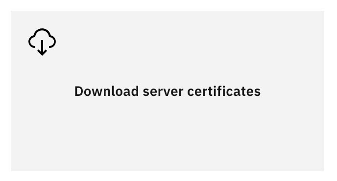
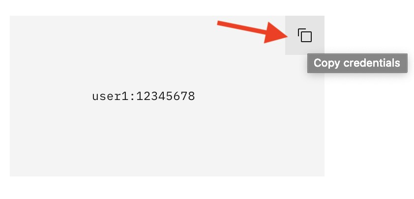
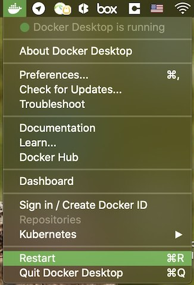
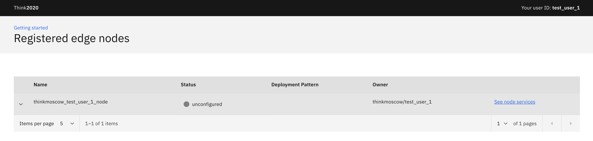

# Code @ Think - Edge Computing workshop lab

_some introduction here_ ...

---

### Before you begin

First you need to install some software and make pre-configuration of your environment. Make sure you have passed [Preparation & pre-installation guide](Preparation.md) for that.

### Obtaining lab server certificates

Some services like your machine Docker and edge service you will deploy are using lab server certificates for their connections.

To download these certificates to you machine you should go 
to helper UI and click on `Download server certificates` link.



Contents is an archive file the following cert files:

- `registry.crt` -- for Docker to connect to image registry
- `ca.crt` -- for edge service to connect lab server machine

Unzip this file to anywhere on your machine, but remember the paths to certs - we will use them to configure our environment later.

### Obtaining your lab user credentials

To help you with finding your progress during making these scripts for edge configuration & deployment, and to start with test user credentials for lab completion, you should visit helper UI welcome page ([link on the helper UI]()) and click on `Obtain token` button.

You can then see obtained user ID in place of button you clicked, and this user ID is also showing in the right-top corner of the helper UI page.

By clicking on `Copy credentials` button you can make a clipboard copy of your credentials in format like they are presented in credentials block in helper UI:

```
<user_id>:<token>
```



Let's go to the next section and populate configuration file with some variable for your environment, including user credentials and server certificates paths.

Do not disturb about closing helper UI welcome page - your credentials are reserved for you after obtaining, and you are able to copy them in the next section.

### Populating environment variables config

In your lab working directory you can see `envvars.mk.sample` file with some environment properties, required for lab scripts execution.

Create a copy of it named `envvars.mk`.

```bash
cp envvars.mk.sample envvars.mk
# then edit envvars.mk file and put missing data
```

Now make a clipboard copy of your user credentials from welcome page by clicking on `Copy credentials` button there (see [Obtaining your lab user credentials](#obtaining-your-lab-user-credentials))

Place these credentials in envvars.mk file, considering that:

- `HORIZON_USER` and `HORIZON_TOKEN` -- Horizon access credentials, and respectively your user ID and token you copied just now.
- `HORIZON_NODE` and `HORIZON_NODE_TOKEN` -- Your edge node specific credentials, just come up with some kind of your node ID and node token to register it in Exchange.
- `HORIZON_MACHINE_CA_CERT` and `REGISTRY_CERT` -- absolute paths on your machine to `ca.crt` and `registry.crt` files you've downloaded previously at [Obtaining lab server certificates](#obtaining-lab-server-certificates)

This set of variables is enough for all operations below, so you can continue to prepare you device.

### Setup Docker environment to work with images registry

Since there is a private registry raised for the Docker images that users will publish to there and run as edge services, we also need to provide registry cert for Docker to make it available to push images in that registry.

If you haven't yet downloaded `registry.crt` file, pass the [Obtaining lab server certificates](#obtaining-lab-server-certificates) and then [Populating environment variables config](#populating-environment-variables-config) sections above.

It's time to pass registry cert to Docker **certs.d** folder. To do that with proper registry host bind, run the following command from `<lab_workdir>`:

```bash
cd <lab_workdir>
make add-docker-reg-cert
```

On Mac, you then have to restart Docker daemon for changes to take effect. You can use toolbar Docker Desktop icon menu `-> Restart`.



On Linux, you do not need to restart Docker daemon - it is already put into target **/etc/docker/certs.d** directory.

Final step here is registry authorization. Perform the command below to login your Docker with registry user credentials.

```bash
make docker-login
```

> NOTE: `REGISTRY_USER` and `REGISTRY_TOKEN` for registry authorization are defined in `envvars.mk` and referred to your Horizon user credentials - they are equivalent to each other in this lab.

Now you can build your first edge service and publish its image to registry.

### Horizon service build & publication

Generally, each Horizon service consists of Docker image artifacts, service definitions and (optionally) service policies.

Before we can start service on Horizon node, we should build its image and push it into registry for further registered node agent access. Below are commands for doing that in a robust way.

```bash
make build
```

```bash
make push
```

Then we should ensure our services & patterns being signed when publishing them to Horizon Exchange. This can be reached by generating PKI key pair for our Horizon user. Signing operation will be called automatically in further when we try to publish service/pattern.

Command to generate singing PKI key pair:

```bash
make gen-service-keys
```

In our case, we prepared Horizon service definition and pattern for its deployment, but it is also possible to use deployment policies, which are good for conditioning service deployment (you can define node properties and constraints to match before service can be delivered to your node).

Let's make our `hellothink` service and pattern publication at Horizon Exchange by calling this small command:

```bash
make publish
```

You can easily verify that your service and pattern were publiushed appropriately by calling the commands below.

```bash
make get-exchange-service
```

outputs:

```bash
hzn exchange service list \
                -o thinkmoscow \
                -u test_user:12345678 \
                test_user.hellothink_1.0.0_amd64
{
  "thinkmoscow/test_user.hellothink_1.0.0_amd64": {
    "owner": "thinkmoscow/test_user",
    "label": "test_user.hellothink for amd64",
    "description": "",
    "documentation": "",
    "public": true,
    "url": "test_user.hellothink",
    "version": "1.0.0",
    "arch": "amd64",
    "sharable": "singleton",
    "matchHardware": {},
    "requiredServices": [],
    "userInput": [
      {
        "name": "MQTT_BROKER_URI",
        "label": "MQTT broker instance for messaging",
        "type": "string",
        "defaultValue": ""
      }
    ],
    "deployment": "{\"services\":{\"hellothink\":{\"command\":[\"test_user.hellothink\"],\"image\":\"169.168.100.1:443/thinkmoscow2020/test_user.hellothink:1.0.0\",\"privileged\":false}}}",
    "deploymentSignature": "Y2xXeVXUGIFTloXwdWAw+hYcNDYhO+RrSY0T9Z5ijrMMuTBQfeEiR89QT7/M6utEN2IUeFVTGe9hlO2eeWWGHSQNgeIvjKo2/fxSb5wowf+MOh5olsZ6y0iRrn+MWGhYECA8epfWN0D8p3Rsd7V0NcvdxAO/u9Q8pWqS39azincgnlvxcF+OASI5NmazcOew4lT1JFrlHRhLFRLmGATbnmRj5SlF+hWPMxUvM0IungW/vK6Vwiujq4EDqINwoVWHUpeN7QYi1waOashfrk2hIgtPDoBh4tOcqpfo9t8t7F0MKguWOE+huly741qQzcmuOoRifPPg044eMtBR7qCkc2+UHTZ8X4MUcfoL8U39MgDwZ7SYEnlRvVP63dsA9f4B8LhfP6oYCkNHLq33tVUupwQPDUfZ9XQy/Om8PrBSMDihx0Fo5ZNk9704gy2LT0hvzV6pGZVSOtoOwBNHeK6Iaw4l8zP7NaATBn9D3L3ps2o0SolbZV6zJWP+TyhJKjyTLDIaLPONMFqhy/ynqjELfDISGdvxh+58Mga9IimTSx2yeUpl2Qmh3jlrL5QWEAta9OqkWm//zNDnR6CnUzqckV1RwK7oyirpWt8GAm3tdXK8xuH2bIBBn52wndA/VcyzOoZ5MmRmKrz+tcP3RPRkyzVtZi72kxGJr+dho2ffUDc=",
    "lastUpdated": "2020-06-02T15:51:14.728Z[UTC]"
  }
}
```

```bash
make get-exchange-pattern
```

outputs:

```bash
hzn exchange pattern list \
                -o thinkmoscow \
                -u test_user:12345678 \
                pattern-test_user.hellothink-amd64
{
  "thinkmoscow/pattern-test_user.hellothink-amd64": {
    "owner": "thinkmoscow/test_user",
    "label": "Think Moscow services pattern for amd64 -- USER=test_user",
    "description": "Think Moscow services pattern for amd64 -- USER=test_user",
    "public": false,
    "services": [
      {
        "serviceUrl": "test_user.hellothink",
        "serviceOrgid": "thinkmoscow",
        "serviceArch": "amd64",
        "serviceVersions": [
          {
            "version": "1.0.0",
            "priority": {},
            "upgradePolicy": {}
          }
        ],
        "dataVerification": {
          "metering": {}
        },
        "nodeHealth": {
          "missing_heartbeat_interval": 1800,
          "check_agreement_status": 1800
        }
      }
    ],
    "agreementProtocols": [
      {
        "name": "Basic"
      }
    ],
    "lastUpdated": "2020-06-02T15:51:15.206Z[UTC]"
  }
}
```

### Node registration

It's time to make our node Horizon agent do real job for us.

At first, it is useful to create your node definition at Horizon Exchange to make it visible for our next configuration.

```bash
make create-node
```

You are now able to see you node in the helper UI, by clicking on `Show registered edge nodes` button at welcome page. It's status is **Unconfigured** so far, and we define the pattern for it when make it registered.



But before we register our edge node, let's prepare node userinput file with some environment variables, useful for future service. You could see these variable in the bottom section of `envvars.mk` file.

The script below generates `node.userinput.json` file which will be used in the node registration process to pass all that we need for our services from the edge node environment.

```bash
make node-userinput
```

Now we can register our node with the pattern where our workload (`hellothink` service) referred. Pattern name, node token and Horizon org we are using here are all defined at make context created from `envvars.mk`.

Run node registration command:

```bash
make register-node
```

Now you'are able to see in helper UI Registered edge nodes page that your node is `Configured` and has deployment pattern.

Since this moment, you Horizon agent is trying to obtain a new agreement for workload defined in deployment pattern (`hellothink` service), checking Docker images for that and finally starting Docker container with your edge service on your machine.

### Proccess monitoring

Commands below are optional, but can help with understanding that our Horizon agent is processing agreements and executing services deployment.

Good way to monitor agreements & events our agent has for service deployments is to use `hzn` CLI command.

This command starts a 2s-period monitor of agreements list API output:

```bash
watch hzn agreement list
```

> NOTE: If you don't have watch tool on your device, install it using `brew install watch` on Mac OS or `sudo apt install watch` on Ubuntu/Debian.

Agreement processing is not instant and consists of from agreement creation, agent acceptance, service resources preparation and container starting process in the end.

The output for finalized agreement with running service state (`agreement_execution_start_time` populated) should be like below:
```
[
  {
    "name": "pattern-test_user.hellothink-amd64_test_user.hellothink_thinkmoscow_amd64 merged with pattern-test_user.hellothink-amd64_test_user.hellothink_thinkmoscow_amd64",
    "current_agreement_id": "5930d54d7992e5793bad9d880e9e080533d48612b07fc448bbefa33365efe947",
    "consumer_id": "thinkmoscow/thinkagbot",
    "agreement_creation_time": "2020-06-02 18:51:50 +0300 MSK",
    "agreement_accepted_time": "2020-06-02 18:52:00 +0300 MSK",
    "agreement_finalized_time": "2020-06-02 18:52:00 +0300 MSK",
    "agreement_execution_start_time": "2020-06-02 18:52:02 +0300 MSK",
    "agreement_data_received_time": "",
    "agreement_protocol": "Basic",
    "workload_to_run": {
      "url": "test_user.hellothink",
      "org": "thinkmoscow",
      "version": "1.0.0",
      "arch": "amd64"
    }
  }
]
```

In parallel, you can run this command for obtaining list of last 10 events:

```bash
watch "hzn eventlog list | tail -n 10"
```

Here are the example log of events for Horizon agent, receiving by that command:

```bash
  "2020-06-02 18:51:38:   Start service auto configuration for thinkmoscow/test_user.hellothink.",
  "2020-06-02 18:51:38:   Complete service auto configuration for thinkmoscow/test_user.hellothink.",
  "2020-06-02 18:51:38:   Complete node configuration/registration for node thinkmoscow_test_user_node.",
  "2020-06-02 18:51:49:   Node received Proposal message using agreement 5930d54d7992e5793bad9d880e9e080533d48612b07fc448bbefa33365efe947 for service thinkmoscow/test_user.hellothink from the agbot thinkmoscow/thinkagbot.",
  "2020-06-02 18:52:00:   Agreement reached for service test_user.hellothink. The agreement id is 5930d54d7992e5793bad9d880e9e080533d48612b07fc448bbefa33365efe947.",
  "2020-06-02 18:52:00:   Start dependent services for thinkmoscow/test_user.hellothink.",
  "2020-06-02 18:52:00:   Start workload service for thinkmoscow/test_user.hellothink.",
  "2020-06-02 18:52:01:   Image loaded for thinkmoscow/test_user.hellothink.",
  "2020-06-02 18:52:02:   Workload service containers for thinkmoscow/test_user.hellothink are up and running."
]
```

Of course, since services are starting as Docker containers, you can invoke to see whether your service is already running:

```bash
docker ps
```

To see service logs, you can perform one of the following commands according to your platform.

For Linux, run:

```bash
sudo tail -f /var/log/syslog | grep hellothink[[]
```

For Mac OS, run:

```bash
sudo docker logs -f $(sudo docker ps -q --filter name=hellothink)
```

Here `hellothink` is the name of your service.

### Summary

--- TBD

### Cleanup

To unregister device node and stop all running services created by Horizon agent on it, run the following command:

```bash
make unregister-node
```

Then run cleanup script to remove Docker images from local machine, Horizon Exchange node, pattern and service, created during the above steps:

```bash
make clean
```

### How to get a completion certificate

To get the certificate please go to the UI: Link, 
find you edge device registered, check if service is up and running and print certificate!

### Useful links

--- TBD
